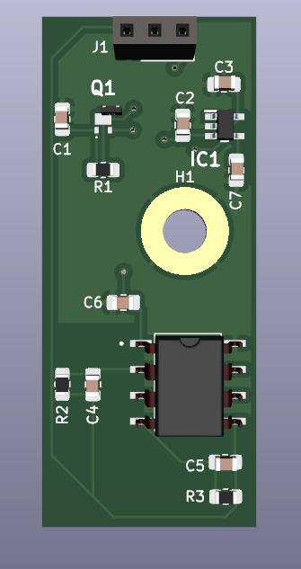
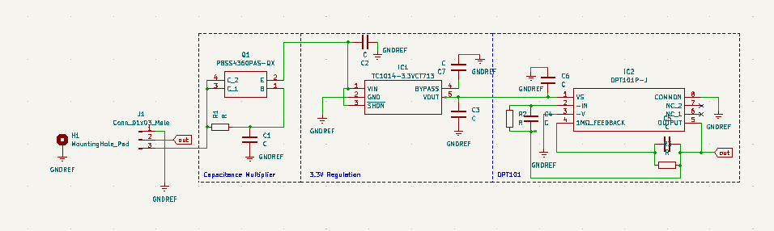

# Simple-Slow-Photodiode-Front-End (Work in progress)
This project aims to provide a simple slow (~15KHz) but very cheap and low noise photodiode front end, for the use in building scientific instrumentation.

## BILL OF MATERIALS
  ```
Later
  ```



The general scheme of this device is shown below. As can be seen, it is formed of three sections: a capacitance multiplier, a 3.3V regulator, and the OPT101 itself. The first two stages function to minimise input noise as much as possible, with the capacitance multiplier functioning to almost entirely remove mains ripple. The OPT101 is a monolithic photodiode and single-supply transimpedance amplifier, so conveniently amplifies the photodiode output without . The disadvantage of course is that it has a relatively limited bandwidth of ~15KHz, but this should be good enough for applications that require only a slow response time such as a spectrophotometer.




  
 ## Assembly


